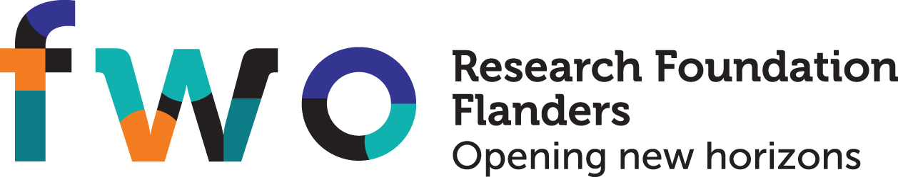

p3droslo
########

Welcome to the p3droslo documentation! p3droslo is a software library for probabilistic 3D reconstruction of astronomical spectral line observations, developed by `Frederik De Ceuster <https://freddeceuster.github.io>`_.

.. toctree::
   :maxdepth: 1
   :caption: Contents:

   background/index
   examples/index
   API/index

Installation
************

Get the latest release (version 0.0.8) either from `PyPI <https://pypi.org/project/p3droslo/>`_, using pip, with:

.. code-block:: shell

    pip install p3droslo

or from `Anaconda.org <https://anaconda.org/FredDeCeuster/p3droslo>`_, using conda, with:

.. code-block:: shell

    conda install -c freddeceuster p3droslo 

or download the `source code <https://github.com/Magritte-code/p3droslo/archive/refs/heads/main.zip>`_, unzip, and install with pip by executing:

.. code-block:: shell

    pip install .

in the root directory of the code.

Issues
******

Please report any issues with this software or its documentation `here <https://github.com/Magritte-code/p3droslo/issues>`_.

Contributing
************

We are open to contributions to p3droslo. More information can be found `here <https://github.com/Magritte-code/p3droslo/blob/main/CONTRIBUTING.md>`_.

Collaborating
*************

We are always interested in collaborating on exciting projects! So, if you have a project (or just an idea for a project), or data that might benefit from (probabilistic) 3D reconstruction or any part of the methodology you can find in this repository, please contact `me <https://freddeceuster.github.io>`_.

Acknowledgements
****************

Frederik De Ceuster is a Postdoctoral Research Fellow of the `Research Foundation - Flanders (FWO) <https://www.fwo.be/en/>`_, grant number 1253223N, and was previously supported for this research by a Postdoctoral Mandate (PDM) from `KU Leuven <https://www.kuleuven.be/english/kuleuven/index.html>`_, grant number PDMT2/21/066.

|

.. image:: images/KU_Leuven_logo.png
  :width: 30%
  :align: left
  :alt: KU Leuven logo